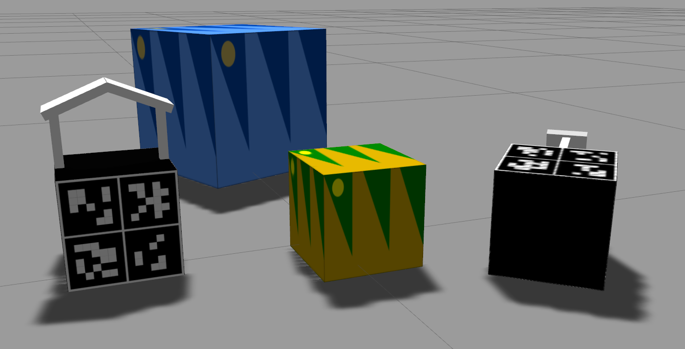
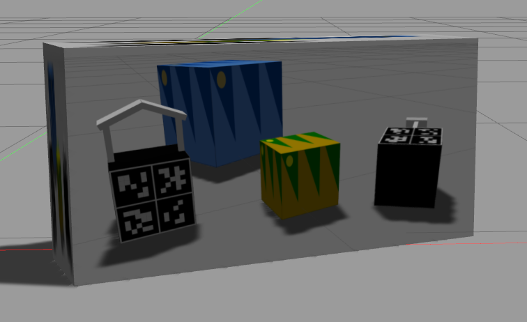

# Gazebo image textures

This package gives an example how to add image textures to URDF files so that they are visible in Gazebo.  
Below you can find some images of the final result.





## Usage

Add the package to a workspace and build it (`catkin_make`).  
Then you can start Gazebo and spawn the cubes.

### Launch gazebo

Source your workspace!
```
source devel/setup.bash
```

Launch Gazebo
```
roslaunch gazebo_ros empty_world.launch
```

### Spawn the cubes

Source your workspace.
```
source devel/setup.bash
```

Spawn simple cube 1.
```
roslaunch example_models spawn_simple_cube1.launch
```

Spawn simple cube 2.
```
roslaunch example_models spawn_simple_cube2.launch
```

Spawn the aruco cube.
```
roslaunch example_models spawn_aruco_cube.launch
```

Spawn the aruco cube with another texture.  
This can be done via the `use_texture_...` parameters.  
One of the texture is used by default so we set it to `false` and set the other texture to `true`.

```
roslaunch example_models spawn_aruco_cube.launch use_texture_0to15:=false use_texture_16to31:=true
```

To be able to spawn multiple aruco markers at the same time, each one needs a different model name.  
It can be provided in the following way:

```
roslaunch example_models spawn_aruco_cube.launch model_name:=aruco_cube2
```

## How to

To add an image texture to a URDF link, do the following:

Create this folder structure in your package with the robot description:

```
package_root_folder/media/materials/scripts/
package_root_folder/media/materials/textures/
```

In the `scripts` folder you create a `your_model.material` file and put this in it:

```
material YourTexture{
technique
{
    pass
    {
        texture_unit
        {
            texture your_image.jpg
            scale 1 1
        }
    }   
}
}
```

You can add multiple textures in this file.

In the `textures` folder put `your_image.jpg`.

In the `package.xml` of your package add this:

```xml
<exec_depend>gazebo_ros</exec_depend>
<export>    
    <gazebo_ros gazebo_media_path="${prefix}"/>                             
</export>
```

Create a `urdf.xacro` and a `gazebo.xacro` file.
In the `urdf.xacro` file create your urdf. Also include the `gazebo.xacro` file with

```xml
<xacro:include filename="$(find your_package_name)/path/to/your_model.gazebo.xacro"/>
```

To use the texture on a link now, add the following within your `gazebo.xacro` file:

```xml
<gazebo reference="your_urdf_link_name">
    <material>YourTexture</material>
</gazebo>
```

Note that `YourTexture` is the name of the material you gave it in the `.material` file,
not the name of the `.material` file itself.

## Further notes

* It might be necessary to restart gazebo / the ROS core if applying the texture does not work.

* Be sure that the terminal with which you launch gazebo (e.g. with `roslaunch gazebo_ros empty_world.launch`) has your workspace sourced (`source devel/setup.bash`).

* For more details on e.g. the launch files or the URDF structure have a look at the source code.

* It was also tested to add the textures directly into `.DAE` files which also worked.  
  It resulted in worse reflective behavior though which made the textures less bright.  
  There might be a possibility to fix this behavior but I didn't find it.

* This was tested with ROS Noetic and Gazebo 11.5.1 but might also work with other ROS / Gazebo versions.
